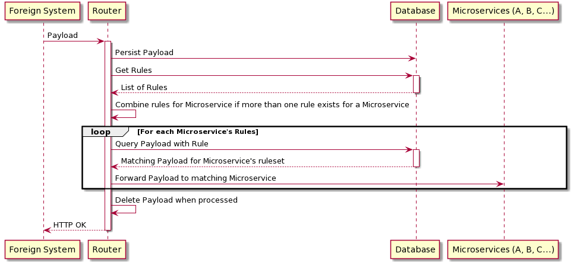

# Introduction

This is a basic implementation of a system that sits between others and routes requests to other services according to dynamic rules and permissions.

There is a high level set of rules, which are:

- Microservice A: Must receive ALL payloads
- Microservice A: Must not receive payloads about campaign B
- Microservice C: Must receive ALL payloads
- Microservice B: Must receive payloads about sales only

Payloads are ingested by the `POST /api/ingest` route, and forwarded to an appropriate microservice according to the ruleset.

A basic flow diagram of the proposed lifecycle of a payload is below.



The persisted rules in the database should look something like the following, with the view of chaining together rules under the same microservice together with an "AND" statement.

| Microservice | Rule                                           |
|--------------|------------------------------------------------|
| A            | payload is not null                            |
| A            | payload->'campaign'->>'name' != 'Campaign B'   |
| C            | payload is not null                            |
| B            | payload->'query_type'->>'title' == 'SALE MADE' |

- Ingest controller implementation in: `src/app/Http/Controllers/IngestController.php`
- Ingest controller tests in: `src/tests/Feature/IngestTest.php`

## Tests

Run the test suite with:

```
docker-compose run artisan test
```

It will test to see which request payloads are getting forwarded to which microservices.

## Todo

* [x] Create `docker-compose` config for multiple services
* [x] Create tests for testing example payloads
* [x] Hardcoded controller for routing requests to other services
* [x] Create data structure for storing payload routing rules
* [ ] Create data structure for persisting payloads
* [ ] Process payloads according to the payload routing rules

# Credits 

* Docker and nginx boilerplate from [aschmelyun/docker-compose-laravel](https://github.com/aschmelyun/docker-compose-laravel).
